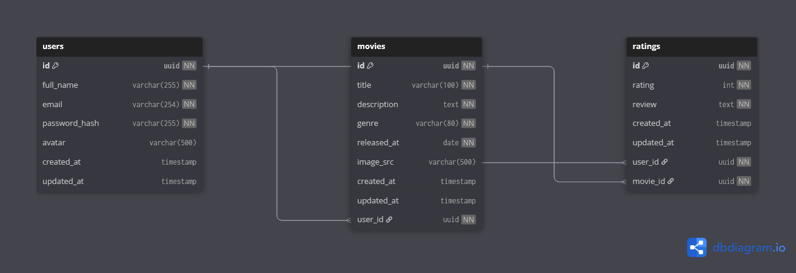

# 🎬 Movies Manager — Desafio Prático

Sistema completo de gerenciamento de filmes com autenticação, cadastro de usuários, avaliações e estrutura MVC em PHP. O projeto inclui modelagem relacional com PostgreSQL, diagrama ER (MER), ambiente Docker e scripts prontos para criação do banco de dados.

## 🧩 Tecnologias Utilizadas

- **PHP** (com estrutura MVC simples)
- **PostgreSQL** (via Docker)
- **Docker Compose**
- **SQL** puro (scripts e constraints)
- **Autenticação por sessão e cookies** (padrão PHP)
- **Diagrama ER** com imagem incluída


## 📁 Estrutura do Projeto

```
movies-manager/
├── app/
│   ├── Controller/
│   ├── DAO/
│   ├── Model/
│   └── View/
├── database/
│   ├── movies_manager_diagram.png
│   └── movies_manager_squema.sql
├── docker/
│   └── docker-compose.yaml
└── README.md
```

## 🚀 Como iniciar o projeto

Para rodar o Movies Manager em ambiente de desenvolvimento, basta subir o servidor embutido do PHP apontando para a pasta `public/`:

```bash
php -S localhost:8000 public/router.php
```

Depois, acesse [http://localhost:8000](http://localhost:8000) no navegador.

Certifique-se de que as dependências do Composer estejam instaladas:

```bash
composer install
```

Se estiver usando Docker para o banco de dados, siga as instruções da seção abaixo.

## 🧠 Modelagem Relacional

O sistema possui 3 entidades principais:

- `users`: usuários que podem se autenticar
- `movies`: filmes criados por usuários
- `ratings`: avaliações com nota e texto, feitas por usuários

### 🖼️ Diagrama ER (MER)




## 🗃️ Scripts SQL

Script completo: [`database/movies_manager_squema.sql`](./database/movies_manager_squema.sql)

```sql
CREATE EXTENSION IF NOT EXISTS "pgcrypto";

CREATE TABLE "users" (
  "id" uuid PRIMARY KEY NOT NULL DEFAULT gen_random_uuid(),
  "full_name" varchar(255) NOT NULL,
  "email" varchar(254) UNIQUE NOT NULL,
  "password_hash" varchar(255) NOT NULL,
  "avatar" varchar(500),
  "created_at" timestamp DEFAULT now(),
  "updated_at" timestamp DEFAULT now()
);

CREATE TABLE "movies" (
  "id" uuid PRIMARY KEY NOT NULL DEFAULT gen_random_uuid(),
  "title" varchar(100) NOT NULL,
  "description" text NOT NULL,
  "genre" varchar(80) NOT NULL,
  "released_at" date NOT NULL,
  "image_src" varchar(500),
  "created_at" timestamp DEFAULT now(),
  "updated_at" timestamp DEFAULT now(),
  "user_id" uuid NOT NULL
);

CREATE TABLE "ratings" (
  "id" uuid PRIMARY KEY NOT NULL DEFAULT gen_random_uuid(),
  "rating" int NOT NULL,
  "review" text NOT NULL,
  "created_at" timestamp DEFAULT now(),
  "updated_at" timestamp DEFAULT now(),
  "user_id" uuid NOT NULL,
  "movie_id" uuid NOT NULL
);

CREATE UNIQUE INDEX ON "movies" ("title", "user_id");
CREATE UNIQUE INDEX ON "ratings" ("user_id", "movie_id");

COMMENT ON TABLE "users" IS 'Users who can log in, create and review movies.';
COMMENT ON TABLE "movies" IS 'Movies created by users. Each movie belongs to a single user.';
COMMENT ON TABLE "ratings" IS 'Each rating belongs to a user and a movie. A user can only rate a movie once.';
COMMENT ON COLUMN "ratings"."rating" IS 'Value must be between 1 and 5 (enforced by CHECK constraint).';

ALTER TABLE "movies" ADD FOREIGN KEY ("user_id") REFERENCES "users" ("id");
ALTER TABLE "ratings" ADD FOREIGN KEY ("user_id") REFERENCES "users" ("id");
ALTER TABLE "ratings" ADD FOREIGN KEY ("movie_id") REFERENCES "movies" ("id");

ALTER TABLE "ratings"
ADD CONSTRAINT rating_value_range CHECK ("rating" BETWEEN 1 AND 5);
```


## 🐳 Ambiente Docker

### `docker/docker-compose.yaml`

```yaml
version: '3.8'

services:
  pgsql_database:
    image: bitnami/postgresql:17.5.0
    container_name: movies_manager_pgsql
    restart: always
    ports:
      - "5432:5432"
    environment:
      - POSTGRESQL_USERNAME=postgres
      - POSTGRESQL_PASSWORD=postgres
      - POSTGRESQL_DATABASE=movies_manager
      - POSTGRESQL_TIMEZONE=UTC
    volumes:
      - movies_manager_pgsql_data:/bitnami/postgresql

volumes:
  movies_manager_pgsql_data:
    driver: local
```

### 🔧 Como subir o ambiente

```bash
# Subir o PostgreSQL com Docker
docker-compose -f docker/docker-compose.yaml up -d
```

### 🧪 Acessar o banco de dados

Você pode usar qualquer cliente como DBeaver, Beekeeper, TablePlus, ou o próprio `psql`:

```
Host: localhost
Port: 5432
User: postgres
Password: postgres
Database: movies_manager
```


## 🔐 Autenticação

O sistema utilizará autenticação tradicional com **sessões e cookies**, usando os mecanismos nativos do PHP. Isso inclui:

- Login com email e senha
- Armazenamento seguro da senha com hash (ex: `password_hash()`)
- Validação via `$_SESSION`
- Proteção de rotas


## ✅ Possíveis Evoluções Futuras

- Interface web com formulários para cadastro, login e avaliação
- Paginação e filtros na listagem de filmes
- Favoritos e comentários
- API REST ou GraphQL
- Testes automatizados (PHPUnit)


## 📄 Licença

Este projeto é parte de um desafio prático e está disponível apenas para fins educacionais e de demonstração.

## 🧑🏻‍🦱 Contato

[LinkedIn](https://linkedin.com/in/edsonrobertopimenta/)
[Email](mailto:dev.edsonpimenta@gmail.com)
